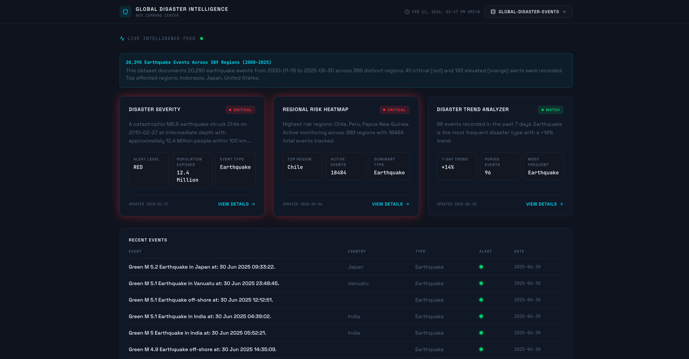

# Risk Intelligence Dashboard



A real-time global disaster monitoring and intelligence platform that analyzes, visualizes, and tracks disaster events across regions worldwide. Built with Next.js and powered by an automated data processing pipeline.


## Features

- **Live Intelligence Feed** -- AI-generated executive summaries with key risk insights
- **Disaster Severity Analysis** -- Detailed event breakdowns with magnitude, population exposure, and alert levels
- **Regional Risk Heatmap** -- Aggregated risk scores across 389+ monitored regions
- **Trend Analysis** -- 7-day disaster trend tracking with severity breakdowns and escalation detection
- **Interactive Event Explorer** -- Sortable event tables with drill-down into individual disaster details
- **Dataset Selector** -- Switch between multiple processed datasets on the fly
- **Responsive Design** -- Fully responsive dark-themed command center UI

## Pages

| Route | Description |
|---|---|
| `/` | Main dashboard with summary cards, intelligence feed, and recent events table |
| `/disaster` | Detailed event view with timeline, impact breakdown, and AI analysis |
| `/regional-analysis` | Regional risk distribution, clustering summary, and severity mapping |
| `/trend-analysis` | Interactive trend charts, event type breakdown, and escalation detection |

## Tech Stack

- **Framework:** Next.js 16 (App Router, static export)
- **UI:** React 19, Tailwind CSS 4, Framer Motion
- **Language:** TypeScript 5
- **Icons:** Lucide React
- **Fonts:** Space Grotesk, JetBrains Mono
- **Data Pipeline:** Python 3

## Getting Started

### Prerequisites

- Node.js 18+
- Yarn
- Python 3 (for data processing only)

### Installation

```bash
# Clone the repository
git clone <repo-url>
cd risk-intelligence-dashboard

# Install dependencies
yarn install
```

### Development

```bash
yarn dev
```

Open [http://localhost:3000](http://localhost:3000) to view the dashboard.

### Production Build

```bash
yarn build
yarn start
```

The build step automatically copies processed datasets from `documents/cleanDataset/` into `public/data/` via the prebuild script.

## Data Pipeline

The dashboard consumes static JSON datasets generated from raw CSV files (e.g., GDACS disaster feeds).

### Processing Raw Data

```bash
# Process all CSV files in documents/rawData/
yarn data:process

# Process a specific file
yarn data:process:file <path-to-csv>
```

The pipeline generates five JSON files per dataset:

| File | Content |
|---|---|
| `analysisSummary.json` | Executive summary with AI-generated headline, insights, and risk score |
| `disasterSeverity.json` | Full event list with coordinates, alert levels, and AI summaries |
| `regionalRiskHeatmap.json` | Regional aggregation with risk scores and dominant disaster types |
| `disasterTrendAnalyzer.json` | Daily trend data with severity breakdowns |
| `recentEvents.json` | Top recent events for the dashboard feed |

### Data Flow

```
documents/rawData/*.csv
  → scripts/process-data.py
  → documents/cleanDataset/<dataset-name>/*.json
  → (prebuild) public/data/<dataset-name>/*.json
  → Frontend fetches from /data/
```

## Project Structure

```
risk-intelligence-dashboard/
├── app/                        # Next.js App Router pages
│   ├── page.tsx               # Main dashboard
│   ├── layout.tsx             # Root layout (fonts, metadata)
│   ├── globals.css            # Theme, colors, animations
│   ├── disaster/              # Event detail page
│   ├── trend-analysis/        # Trend analysis page
│   └── regional-analysis/     # Regional analysis page
├── components/                 # Reusable UI components
│   ├── Navbar.tsx             # Header with dataset selector
│   ├── DashboardCard.tsx      # Base card component
│   ├── DisasterSeverity.tsx   # Severity card
│   ├── RegionalRiskHeatmap.tsx
│   └── DisasterTrendAnalyzer.tsx
├── lib/                        # Shared utilities and types
│   ├── types.ts               # TypeScript interfaces
│   ├── config.ts              # Deployment config (basePath)
│   └── dummy-data.ts          # Fallback data
├── scripts/
│   ├── process-data.py        # CSV → JSON data pipeline
│   └── prebuild.mjs           # Copies datasets to public/
├── documents/
│   ├── rawData/               # Input CSV files
│   └── cleanDataset/          # Processed JSON datasets
└── public/data/               # Served datasets (built)
```

## Configuration

| Variable | Description | Default |
|---|---|---|
| `NEXT_PUBLIC_BASE_PATH` | Base path for subdirectory deployment | `""` |

No `.env` file is required. The app serves static JSON data with no external API calls at runtime.

## Deployment

The app builds as a static export, making it deployable to any static hosting provider:

```bash
yarn build
# Output in .next/ or out/ directory
```

For subdirectory deployment, set `NEXT_PUBLIC_BASE_PATH`:

```bash
NEXT_PUBLIC_BASE_PATH=/dashboard yarn build
```

## License

This project is private.
